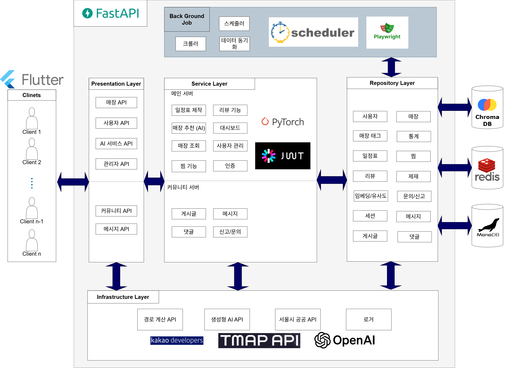
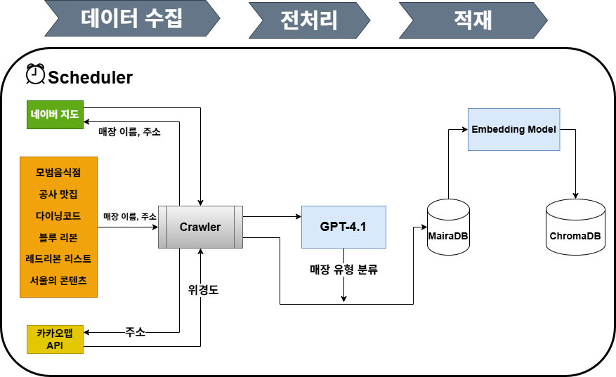

# Project Documentation

FastAPI 기반 장소 추천 및 일정 관리 시스템

## 프로젝트 개요

사용자의 선호도를 AI로 분석하여 맞춤형 장소(음식점, 카페, 콘텐츠)를 추천하고, 경로를 계산하여 일정표를 생성하는 서비스입니다.

### 주요 기능

1. AI 대화형 장소 추천
2. 경로 계산 및 일정표 생성
3. 리뷰 및 평점 시스템
4. 찜 기능
5. 네이버 지도 크롤링
6. 벡터 DB 기반 검색
7. 관리자 대시보드

## 기술 스택
### Frontend
### Backend


- ChromaDB (Vector DB)

### AI/ML
- OpenAI GPT-4
- intfloat/multilingual-e5-large (임베딩)

### Crawling
- Playwright


### External APIs
- 카카오맵 API
- T맵 API
- 공공데이터포털 날씨 API

## 프로젝트 구조

```
src/
├── domain/              # 도메인 레이어
│   ├── dto/            # Data Transfer Objects
│   └── entities/       # Database Entities
├── infra/              # 인프라 레이어
│   ├── database/       # 데이터베이스
│   ├── cache/          # Redis
│   ├── external/       # 외부 API
│   └── vector_database/ # ChromaDB
├── service/            # 서비스 레이어
│   ├── auth/          # 인증
│   ├── user/          # 사용자 관련
│   ├── category/      # 카테고리(매장)
│   ├── application/   # AI 추천 시스템
│   ├── crawl/         # 크롤링
│   ├── chromadb/      # 벡터 DB
│   ├── suggest/       # 추천 엔진
│   └── dashboard/     # 대시보드
├── router/             # 라우터 레이어
│   ├── admin/         # 관리자 API
│   └── users/         # 사용자 API
├── logger/             # 로깅
├── utils/              # 유틸리티
└── resources/          # 설정 파일
    ├── config/        # 설정 파일
    ├── crawl/         # 크롤링 설정
    └── html/          # 대시보드 HTML
```

## 아키텍처

### 레이어 구조


### 크롤링 파이프 라인


## 주요 모듈 문서

### Core

- [Domain (DTO/Entity)](src/domain/domain.md)
- [Service](src/service/ServiceReadMe.md)
- [Repository](src/infra/database/repository/repository.md)
- [Router](src/router/router_README.md)

### Infrastructure
- [External APIs](src/infra/external/external.md)

### Utilities

- [Utils](src/utils/utils_README.md)
- [Logger](src/logger/logger_README.md)

### API

- [API 명세서](outputs/API_SPECIFICATION.md)
- [RESTful 개선 제안](outputs/RESTFUL_API_IMPROVEMENTS.md)

## 설치 및 실행

### 1. 환경 설정

```bash
# Python 가상환경 생성
python -m venv venv
source venv/bin/activate  # Windows: venv\Scripts\activate

# 의존성 설치
pip install -r requirements.txt
```

### 2. 설정 파일

`src/resources/config/.env` 파일 생성:

```env
PUBLIC_KEY=your_jwt_secret_key
ISSUE_NAME=your_service_name
KAKAO_REST_API_KEY=your_kakao_key
OPENAI_API_KEY=your_openai_key
TMAP_API_KEY=your_tmap_key
```

`src/resources/config/database_config.json`:

```json
{
  "host": "localhost",
  "port": 3306,
  "user": "root",
  "password": "password",
  "database": "mydb"
}
```

`src/resources/config/redis_config.json`:

```json
{
  "host": "localhost",
  "port": 6379,
  "db": 0
}
```

### 3. 데이터베이스 설정

```bash
# MariaDB 설치 및 실행
# 데이터베이스 생성
mysql -u root -p
CREATE DATABASE mydb;

# 테이블 생성 (스키마는 별도 제공)
```

### 4. Redis 설치 및 실행

```bash
# Redis 설치
# Ubuntu
sudo apt-get install redis-server

# macOS
brew install redis

# 실행
redis-server
```

### 5. ChromaDB 설정

```bash
# 자동으로 로컬에 생성됨
# 또는 원격 서버 설정 (chroma_config.json)
```

## 개발 가이드

### 코드 스타일

- PEP 8 준수
- Type Hints 사용
- Docstring 작성

### 커밋 메시지

```
feat: 새로운 기능 추가
fix: 버그 수정
docs: 문서 수정
style: 코드 포맷팅
refactor: 코드 리팩토링
test: 테스트 코드
chore: 기타 작업
```

### 브랜치 전략

```
main         - 프로덕션
develop      - 개발
feature/*    - 기능 개발
hotfix/*     - 긴급 수정
```

## 테스트

```bash
# 단위 테스트
pytest tests/unit

# 통합 테스트
pytest tests/integration

# 전체 테스트
pytest

# 커버리지
pytest --cov=src tests/
```

## 배포

### Docker

```dockerfile
FROM python:3.10

WORKDIR /app
COPY requirements.txt .
RUN pip install -r requirements.txt

COPY src/ ./src/
CMD ["uvicorn", "src.main:app", "--host", "0.0.0.0", "--port", "8080"]
```

## 모니터링

### 로그

```bash
# 로그 확인
tail -f logs/src/src-2024-11-18.txt

# 에러 로그
grep ERROR logs/src/src-2024-11-18.txt
```

### 대시보드

관리자 대시보드: http://localhost:8080/dashboard.html

## 성능 최적화

### 1. 데이터베이스

- 인덱스 활용
- N+1 쿼리 방지
- JOIN 최적화

### 2. 캐싱

- Redis 세션 캐싱
- ChromaDB 검색 결과 캐싱

### 3. 비동기 처리

- async/await 활용
- 병렬 처리

## 보안

### 1. 인증

- JWT 토큰 (Access + Refresh)
- Redis 세션 관리

### 2. 비밀번호

- bcrypt 해싱

### 3. API 키

- 환경 변수로 관리
- .env 파일은 .gitignore에 추가

## 트러블슈팅

### 1. 데이터베이스 연결 실패

```bash
# MariaDB 상태 확인
sudo systemctl status mariadb

# 설정 파일 확인
cat src/resources/config/database_config.json
```

### 2. Redis 연결 실패

```bash
# Redis 상태 확인
redis-cli ping

# 설정 확인
cat src/resources/config/redis_config.json
```

### 3. ChromaDB 오류

```bash
# 디렉토리 권한 확인
ls -la ./chroma_db

# 재생성
rm -rf ./chroma_db
python -m src.service.chromadb.store_chromadb_loader
```

## FAQ

### Q: API 키는 어디서 발급받나요?

A: 
- 카카오: https://developers.kakao.com/
- OpenAI: https://platform.openai.com/
- 공공데이터: https://www.data.go.kr/

### Q: ChromaDB는 로컬과 원격 중 어느 것을 사용하나요?

A: 개발 환경에서는 로컬, 프로덕션에서는 원격 서버 권장

### Q: 크롤링 주기는 어떻게 설정하나요?

A: `src/service/scheduler/crawling_scheduler.py`에서 설정

## 연락처

- 이메일: huni032285@gmail.com
- 이슈: GitHub Issues

## 참고 자료

- [FastAPI 공식 문서](https://fastapi.tiangolo.com/)
- [SQLAlchemy 문서](https://docs.sqlalchemy.org/)
- [ChromaDB 문서](https://docs.trychroma.com/)
- [OpenAI API 문서](https://platform.openai.com/docs/)
